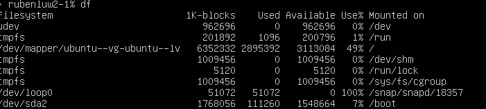
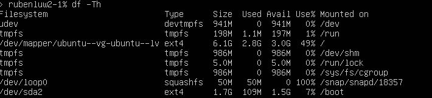
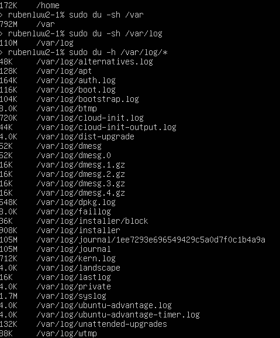
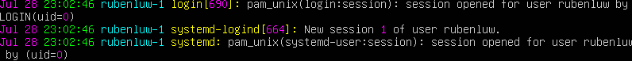
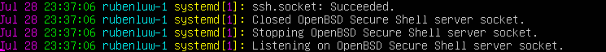
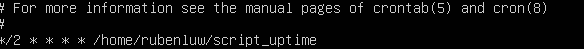

## Part 11. Использование утилиты **df** 

- Запустили команду df. В отчёте написали для корневого раздела (/):

    - размер раздела - 6352332 
    - размер занятого пространства - 2895392
    - размер свободного пространства - 3113084
    - процент использования - 49%
    - единица измерения в выводе - килобайт

- Запустили команду df -Th. В отчёте написали для корневого раздела (/):

    - размер раздела - 6.1G
    - размер занятого пространства - 2.8G
    - размер свободного пространства - 3.0G
    - процент использования - 49%
    - тип файловой системы для раздела - ext4
  
  

## Part 12. Использование утилиты **du**

- Запускаем команду du

- Выводим размер папок /home, /var, /var/log 

- Выводим размер всего содержимого в /var/log (каждого вложенного элемента, используя *)

## Part 13. Установка и использование утилиты **ncdu**

- Установить утилиту ncdu

- Выводим размер папок /home, /var, /var/log

  

  

## Part 14. Работа с системными журналами

- Время последней успешной авторизации, имя пользователя и метод входа в систему: **rubenluw, Jul 28 23:02:46, login** 

- Перезапустили службу SSHd 

- Соообщение о рестарте службы

  
  
  
## Part 15. Использование планировщика заданий **CRON**

##### Используя планировщик заданий, запустим команду uptime через каждые 2 минуты.

- Нашли в системных журналах строчки о выполнении

  
- Вывели на экран список текущих заданий для CRON

  
- Удалили все задания из планировщика заданий

 
