## Part 1. Установка ОС

- Узнаем версию Ubuntu после установки
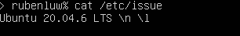
  
  

## Part 2. Создание пользователя

- Создаем нового пользователя и добавляем его в группу adm

- Командой выводим список пользователей

  
  
  
## Part 3. Настройка сети ОС

- Задали название машины и вывели его в терминал
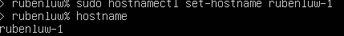

- Установили текущую временную зону и вывели информацию в терминал
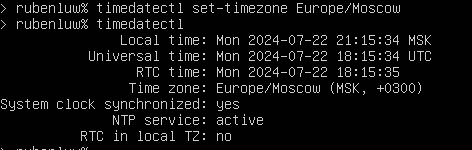

- Установили набор сетевых инструментов и вывели информацию о сетевых интерфейсах
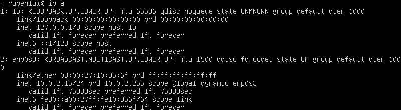

  ***lo (loopback device) - виртуальный интерфейс, присутствующий по умолчанию в любом Linux. Он используется для отладки сетевых программ и запуска серверных приложений на локальной машине. С этим интерфейсом всегда связан адрес 127.0.0.1. У него есть dns-имя – localhost***
  
- Получаем новый ip адрес устройства от dhcp сервера
 

  ***DHCP - Dynamic Host Configuration Protocol - протокол прикладного уровня модели TCP/IP, служит для назначения IP-адреса клиенту***
    
- Вывели внешний IP-адрес шлюза (ip)

- Вывели внутренний IP-адрес шлюза, он же ip-адрес по умолчанию 
 

- Задали статичные настройки ip, gw, dns 
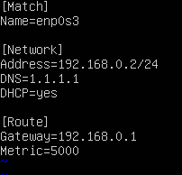

- Перезагрузили машину и убедились, что статичные сетевые настройки (ip, gw, dns) соответствуют заданным в предыдущем пункте
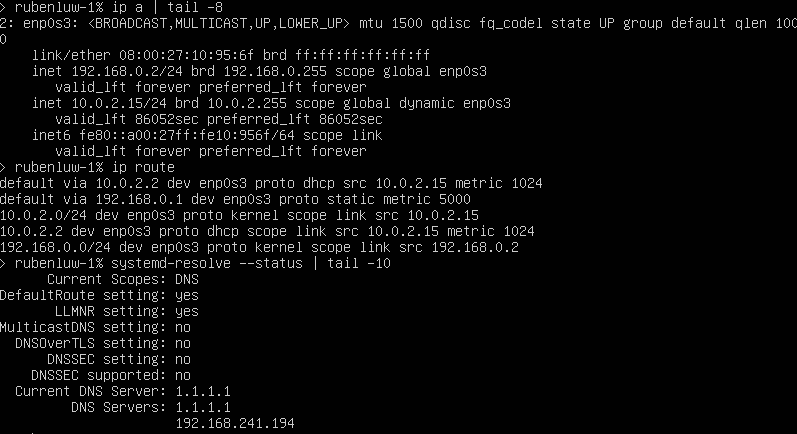

- Успешно пропинговали удаленные хосты 1.1.1.1 и ya.ru
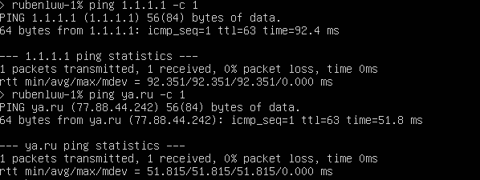
  

## Part 4. Обновление ОС

- Обновили системные пакеты до последней на момент выполнения задания версии и проверили повторным вводом команды
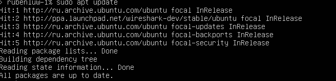 
  
  

## Part 5. Использование команды **sudo**

 ***Sudo — Substitute User and do, дословно «подменить пользователя и выполнить» - команда, позволяющая пользователю запускать программы с привилегиями другой учётной записи, как правило, суперпользователя root. Ее используют прежде какой-либо иной команды в консоли для выполнения с правами администратора***

- Поменяли hostname ОС от имени пользователя, созданного в пункте Part 2, используя sudo
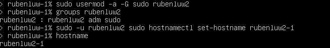 

## Part 6. Установка и настройка службы времени

- Вывод команды с корректным временем
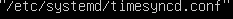 
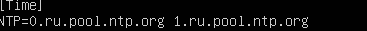 
 

## Part 7. Установка и использование текстовых редакторов 

- Установлены текстовые редакторы VIM, NANO, JOE 

--- 
  
### VIM

- vim test_VIM.txt
- Режим редактирования: i
- Выйти из режима редактирования: esc
- Выход с cохранением: :wq и enter

 

### NANO

- nano test_NANO.txt
- Выход с сохранением: CTRL+X, затем Y и enter

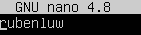 
  

### JOE 

- joe test_JOE.txt
- Выход с cохранением: Ctrl+K, затем клавиша X

 
  
---

### VIM

- Выйти из режима редактирования: esc
- Выход без сохранения: :q! и enter

### NANO

- Выход без сохранения: CTRL+X, затем N

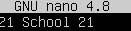

### JOE 

- Выход без сохранения: Ctrl+C, затем клавиша Y 

 
  
---

### VIM

- Поиск: /<что ищем> (для перемещения: N - назад, n - вперед)
- Замена:  :s/<что хотим заменить>/<на что хотим заменить> + enter

  

### NANO

- Поиск: CTRL+W, <что ищем> + enter (alt+W для перехода к след. вхождению, ctrl+C для прекращения поиска)
- Замена: CTRL+ \ <что хотим заменить> + enter + <на что хотим заменить> + enter, затем A(для замены всех найденных) или Y или N (при замене каждого по отдельности)

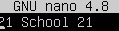
  
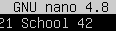

### JOE 

- Поиск: CTRL+K, затем F + enter <что ищем>
- Замена: CTRL+K затем F + enter <что хотим заменить>, затем R <на что хотим заменить>, затем Y

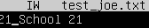
  
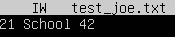
  
  
  
## Part 8. Установка и базовая настройка сервиса SSHD

- Устанавили службу SSHd
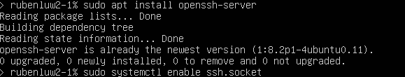
    
- Добавляем автостарт службы при загрузке системы
- Перенастроили службу SSHd на порт 2022

    
- Перезагрузили систему
    
- Используя команду ps, показать наличие процесса sshd. Для этого к команде нужно подобрать ключи

  ***команда ps - показывает запущенные процессы, выполняемые пользователем в окне терминала***
  
    - ps -e или ps -A (Чтобы просмотреть все запущенные процессы);
    - ps -d (Чтобы показать все процессы, кроме лидеров сессии);
    - ps -d -N (можно инвертировать вывод с помощью переключателя -N. Например, если хочу вывести только лидеров сеансов)
    - ps T (увидеть только процессы, связанные с этим терминалом);
    - ps r (просмотреть все работающие (running) процессы);
    - ps -p 'pid' (если вы знаете идентификатор процесса PID, вы можете просто использовать следующую команду, для вывода процесса с этим 'pid');
    - ps U 'userlist' (найти все процессы, выполняемые конкретным пользователем);
    - ps -ef (получить полный список);

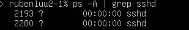
  
- grep sshd - поиск по выводу

- Перезагрузили систему (reboot)

- Команда netstat
   - -t (--tcp) отображает соедниеня только по tcp
   - -a (--all) вывод всех активных подключений TCP
   - -n (--numeric) вывод активных подключений TCP с отображением адресов и номеров портов в числовом формате

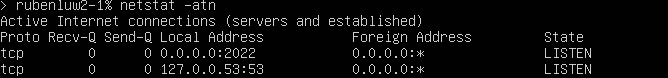

    - Proto: Название(тип) протокола (протокол TCP или протокол UDP);
    - Recv-Q: очередь получения сети (Счётчик байтов не скопированных программой пользователя из этого сокета)
    - Send-Q: сетевая очередь отправки (Счётчик байтов, не подтверждённых удалённым узлом)
    - Local Address: адрес локального компьтера и используемы номер порта
    - Foreign Address: адрес и номер удаленного компьтера к которому подключен сокет
    - State: состояние сокета
    - 0.0.0.0: означает IP-адрес на локальной машине (это немаршрутизируемый адрес IPv4, который используется в качестве адреса по умолчанию или адреса-заполнителя)

## Part 9. Установка и использование утилит **top**, **htop**

- По выводу команды top определили и отразили в отчёте данные
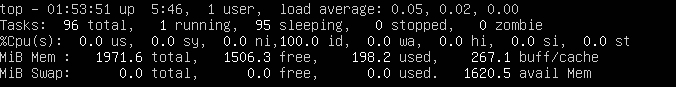

    - uptime: 5:56
    - количество авторизованных пользователей: 1
    - общая загрузка системы: 0.05, 0.02, 0.00
    - общее количество процессов: 96
    - загрузка cpu: 0.0
    - загрузка памяти: 198.2/267.1
    - pid процесса занимающего больше всего памяти(top -o %MEM): 2801
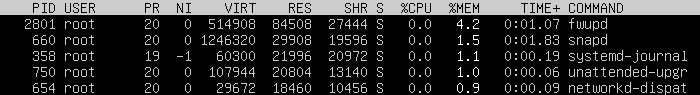
    - pid процесса, занимающего больше всего процессорного времени(top -o %CPU): 3051
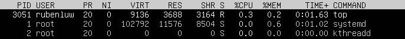

- Вывод команды htop, отсортированный по PID, PERCENT_CPU, PERCENT_MEM, TIME
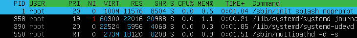

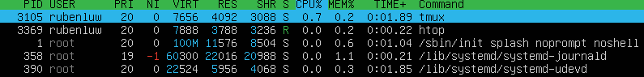
    
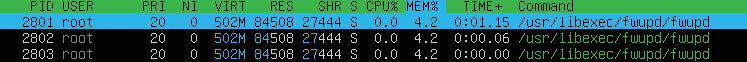
      

  
- Вывод команды htop, отфильтрованный для процесса sshd

  
- Вывод команды htop с процессом syslog, найденным, используя поиск

  
- Вывод команды htop с добавленным hostname, clock и uptime  
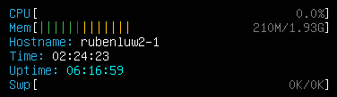

## Part 10. Использование утилиты **fdisk**

- Запустили команду fdisk -l

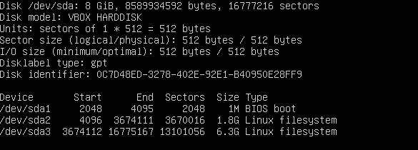
  
    - название жесткого диска - VBOX HARDDISK
    - размер - 8GiB
    - количество секторов - 16777216
    - размер swap - ?

## Part 11. Использование утилиты **df** 

- Запустили команду df. В отчёте написали для корневого раздела (/):

    - размер раздела - 6352332 
    - размер занятого пространства - 2895392
    - размер свободного пространства - 3113084
    - процент использования - 49%
    - единица измерения в выводе - килобайт

- Запустили команду df -Th. В отчёте написали для корневого раздела (/):

    - размер раздела - 6.1G
    - размер занятого пространства - 2.8G
    - размер свободного пространства - 3.0G
    - процент использования - 49%
    - тип файловой системы для раздела - ext4
  
  

## Part 12. Использование утилиты **du**

- Запускаем команду du

- Выводим размер папок /home, /var, /var/log 

- Выводим размер всего содержимого в /var/log (каждого вложенного элемента, используя *)

## Part 13. Установка и использование утилиты **ncdu**

- Установить утилиту ncdu

- Выводим размер папок /home, /var, /var/log

  

  

## Part 14. Работа с системными журналами

- Время последней успешной авторизации, имя пользователя и метод входа в систему: **rubenluw, Jul 28 23:02:46, login** 

- Перезапустили службу SSHd 

- Соообщение о рестарте службы

  
  
  
## Part 15. Использование планировщика заданий **CRON**

##### Используя планировщик заданий, запустим команду uptime через каждые 2 минуты.

- Нашли в системных журналах строчки о выполнении

  
- Вывели на экран список текущих заданий для CRON

  
- Удалили все задания из планировщика заданий
 
